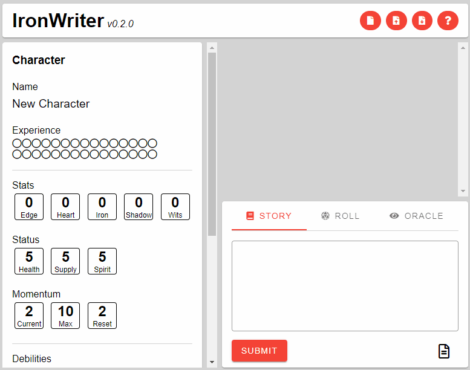
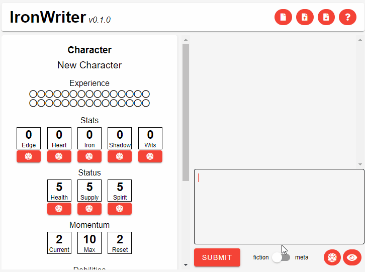
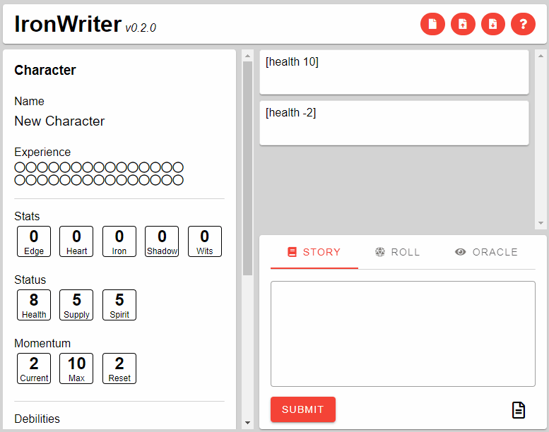
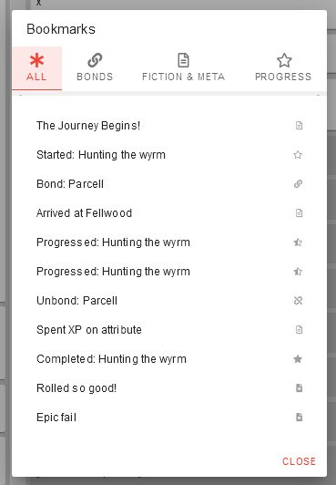

# Overview
IronWriter est un outil d'écriture open-source pour une partie solitaire du jeu de rôle gratuit [Ironsworn](https://www.ironswornrpg.com/).
Concentre-toi sur l'écriture de ton histoire et IronWriter s'occupe de gérer automatiquement les détails de ta fiche de personnage.

⚠ __IMPORTANT__: Le développement de IronWriter est en pause pour un temps indéterminé. Il n'a pas atteint une v1.0 et doit être considéré instable. Il est conseillé d'exporter et de sauvegarder toutes les données importantes. La rétrocompatibilité n'est pas garantie.

## Current Features
* Utilise du markdown au sein de ton histoire pour mettre à jour automatiquement ta fiche de personnage
* Enregistre toutes les caractéristiques, élan, statut et handicaps.
* Enregistre tes jauges de progrès pour tes voeux, tes voyages et tes combats
* Editer un évènement met à jour tout les évènements suivants
* Supprimer des évènements
* Enregistrer les liens et la barre de progrès 
* Jets de dés intégrés, avec prise en compte de l'élan 
* Jets d'oracle intégrés
* Relancer les oracles et les dés
* Importer/Exporter
* Sauvegarder les sessions vers le cache du navigateur
* Enregistrer les atouts 
* Enregistrer l'inventaire 
* Étiquetage manuel des évènements pour référence
* Étiquetage automatique des évènements relatifs aux liens et aux progrès de voeux

## Open Source License
IronWriter is an open-source writing tool for solo playthroughs of the free tabletop RPG Ironsworn.
Copyright (C) 2019 Alex Larioza

This program is free software: you can redistribute it and/or modify
it under the terms of the GNU General Public License as published by
the Free Software Foundation, either version 3 of the License, or
(at your option) any later version.

This program is distributed in the hope that it will be useful,
but WITHOUT ANY WARRANTY; without even the implied warranty of
MERCHANTABILITY or FITNESS FOR A PARTICULAR PURPOSE. See the
GNU General Public License for more details.

You should have received a copy of the GNU General Public License
along with this program. If not, see https://github.com/SHiLLySiT/IronWriter/blob/master/LICENSE.txt.

## Table of Contents
* [Résumé](#Résumé)
* [Raccourcis](#Keyboard-Shortcuts)
* [Documentation](#Documentation)
    * [Tags](#Tags)
        * [Renaming your character](#Renaming-your-character)
        * [Changing Stats](#Changing-Stats)
        * [Adding and Removing Debilities](#Adding-and-Removing-Debilities)
        * [Marking Progress](#Marking-Progress)
        * [Making Bonds](#Making-Bonds)
        * [Managing Assets](#Managing-Assets)
        * [Managing Inventory](#Managing-Inventory)
        * [Bookmarking Events](#Bookmarking-Events)

# Résumé
* Allez à www.alexlarioza.com/IronWriter ou clonez ce repo et ouvrez [index.html](index.html) dans votre navigateur.
* Quand vous écrivez votre histoire, tout est automatiquement sauvegardé en local par votre navigateur. Faites attention, supprimer les données de sites supprimera aussi vos données.
* Utilisez "Importer/Exporter session" to sauvegarder en sécurité votre session en dehors de votre navigateur.

# Raccourcis
* CTRL+Enter: Valider/Sauvegarder un évènement 
* CTRL+M: Changer de mode

# Documentation
IronWriter représente des moments ou un ensemble de contenus pour votre histoire par des "évènements". 
Vous décidez de la quantité de contenu à écrire dans chaque évènement.



Il y a deux types d'évènements : "fiction" et "meta". Techniquement, il n'y a pas de différences entre-eux. 
Mais il sont visuellement différents pour séparer les élèments de la fiction des actions meta comme les actions, les jets d'oracles, etc.



IronWriter utilise des marqueurs spéciaux (appelés "tags") pour mettre automatiquement à jour la feuille de personnage.
Ces tags sont insensible à la casse (`supprimerAtout` est équivalent à `removeasset` et `REMOVEASSET`) et sont toujours entourés de crochets `[]`.
Pour plus de clarté, cette documentation utilisera toujours des majuscules au début des mots (1er exemple ci-dessus) et pour plus de simplicité, 
les crochets ne seront pas indiqués.


> [santé -2][élan -1] Du sang s'écoule lentement de la blessure à mon bras quand le loup essaie de le déchiqueter. J'attrape la dague pendue à ma ceinture.


> Je tire la dague de son fourreau et frappe le cou du loup. `progrès loup` Il relâche enfin mon bras et gémit de douleur. Alors que je pense être enfin tranquille, trois autres loups arrivent en courant de la forêt. `progrès "Meute de loups" redoutable`

_Pour un exemple complet, allez voir [la session d'exemple](./docs/sample.md)._

Les tags contiennent des paramètres pour contrôler comment ils affectent la fiche de personnage ou les propriétés basées sur des évènements, comme les étiquettes.
Les paramètres sont séparés par des espaces. Si vous voulez inclure des espaces dans un paramètre, entourez le de guillemets : `renommer "Brynn Tahir"`.
Dans cette documentation, les paramètres entourés de carets `<parameter>` sont obligatoires et ceux entourés de d'accolades `{parameter}` sont facultatifs.

Tous les évènements sont stockés dans un historique et quand vous éditez un évènement, tous les évènements suivants, dépendants de ce dernier, sont rejoués après vos changements. 



IronWriter utilise un système d'étiquetage d'évènements pour rapidement revenir aux évènements importants.
Il y a deux types d'étiquettes : celles créées par le systèmes automatiquement quand vous jurez/abandonnez un lien/voeu ou réalisez un progrès, 
et celles que vous créez vous-même avec le tag `étiquette`.
Les deux types d'étiquettes sont enregistrées entre les sessions et lors de l'exportation.



# Tags
## Renommer le personnage
Renomme le personnage.
```
renommer <nom personnage>
```
### Parameters
* `<nom personnage>` Le nom voulu.

### Exemple
* `renommer Maura` Change le nom du personnage pour "Maura".
* `renommer "Brynn Tahir"` Change le nom du personnage pour "Brynn Tahir".
    
## Changer les stats.
Change une valeur d'une stat. Le premier paramètre n'est pas littéralement "stat" mais la stat à changer.
```
<stat> {mod}<valeur>
```
### Stats
* vivacité
* coeur
* fer
* ombre
* astuce
* santé
* provision
* esprit
* élan
* expérience
* expérienceDépensée

### Parameters
* `<stat>` La stat à changer
* `<valeur>` La valeur à appliquer à la `stat`.
* `{mod}` La manière d'appliquer le paramètre `valeur`. Les options possibles sont :
    * `+` Ajoute `valeur`.
    * `-` Soustrait `valeur`.
    * Si aucune option spécifiée, la `stat` prend la `valeur`.

### Exemples
* `santé +1` augmente la santé de 1.
* `esprit -2` diminue l'esprit de 2.
* `fer 3` met fer à 3.

## Ajouter et supprimer des handicaps
Ajoute et enlève des handicapts et change automatiquement l'élan maximum et la valeur de réinitialisation de l'élan.
```
est <handicap>
```
```
pas <handicap>
```
### Handicaps
* blessé
* secoué
* mal préparé
* encombré
* mutilé
* corrompu
* maudit
* tourmenté

### Parameters
* `<handicap>` Le handicap à ajouter ou enlever.

### Exemples
* `est blessé` Ajoute le handicap blessé.
* `pas blessé` Enlève le handicap blessé.

## Atteindre un jalon
Commence, complète ou atteint un jalon sur une piste.
```
progrès <nom> {mod}
```

### Paramètres
* `<nom>` Le nom de la piste de progrès.
* `{mod}` La manière de modifier la piste. Les options suivantes sont possibles :
    * `complet` Enlève la piste de progrès de la fiche de personnage.
    * `<rang>` Le rang de la piste de progrès. Les options suivante sont possibles :
        * `pénible` Chaque progrès fait 12 ticks.
        * `dangereux` Chaque progrès fait 8 ticks.
        * `redoutable` Chaque progrès fait 4 ticks.
        * `extrème` Chaque progrès fait 2 ticks.
        * `épique` Chaque progrès fait 1 tick.
    * `{+/-}<valeur>` Le nombre de tick à ajouter, soustaire ou appliquer.
        * `+` Ajoute la `valeur` spécifiée.
        * `-` Soustrait la `valeur` spécifiée.
        * Si aucun opérateur n'est indiqué, applique `valeur` ticks à la piste.
    * Si aucun paramètre n'est indiqué, on ajoute automatiquement le nombre de ticks spécifié par le `rang`.

### Exemples
* `progrès "Tuer Martu" redoutable` Créer une nouvelle piste de progrès nommée "Tuer Martu" avec un rang redoutable.
* `progrès "Tuer Martu"` Augmente le nombre de ticks de 4.
* `progrès "Tuer Martu" +1` Augmente le nombre de ticks de 1.
* `progrès "Tuer Martu" -2` Diminue le nombre de ticks de 2.
* `progrès "Tuer Martu" 8` Applique 8 ticks.
* `progrès "Tuer Martu" complet` Enlève la piste de progrès "Tuer Martu".

## Forger un lien
Ajoute un lien à votre liste de liens et ajoute un tick à votre jauge de liens.
```
lien <nom>
```
```
supprimerLien <nom>
```

### Paramètres
* `<nom>` Texte descriptif du lien.

### Exemples
* `lien Père` Ajoute un lien nommé "Père" et ajoute 1 tick à la jauge de liens.
* `supprimerLien Père` Enlève un lien nommé "Père" et supprime un tick de la jauge de liens.
* `lien "Mai Lucia"` Ajoute un lien nommé "Mai Lucia" et ajoute un tick à la jauge de liens.

## Gérer les atouts
Ajoute et mofifie les atouts du personnage.
```
atout <nom> <capacite>
```
```
atout <nom> <propriété> {mod}<valeur>
```
```
supprimerAtout <nom>
```

Vous devez d'abord ajouter un atout puis ajouter les capacités ou les propriétés, etc.
```
[atout Ritualiste] // ajoute l'atout en premier
[atout Ritualiste 1] // ajoute la première capacité
```

### Paramètres
* `<nom>` Le nom de l'atout
* `<capacite>` Débloque la capacité indiqué par son numéro.
* `<propriété>` Le nom d'une propriété de l'atout.
* `{mod}` La manière d'appliquer `valeur`. Les options suivantes sont possibles :
    * `+` (Uniquement un nombre) Ajoute la `valeur` indiquée.
    * `-` (Uniquement un nombre) Soustrait la `valeur` indiquée.
    * Si aucun modificateur, la propriété est définit par la `valeur`.
* `<valeur>` La valeur de la propriété. Peut être un nombre ou un texte.

### Exemples
* `atout Ritualiste` Ajoute un atout appelé "Ritualiste".
* `atout Ritualiste 1` Débloque la capacité 1 pour l'atout nommé "Ritualiste".
* `atout Faucon Santé 1` Applique la valeur "1" à la propriété "Santé" de l'atout "Faucon".
* `atout Faucon Santé +10` Ajoute "10" à la propriété "Santé" de l'atout "Faucon".
* `atout Faucon Santé -5` Enlève "5" à la propriété "Santé" de l'atout "Faucon".
* `atout Artisan Spécialité Herboriste` Applique la valeur "Herboriste" à la propriété "Spécialité" de l'atout "Artisan".
* `supprimerAtout Artisan` Supprime l'atout "Artisan".

## Gérer l'inventaire
Ajoute et modifie l'inventaire du personnage.
```
objet <nom> <quantité>
```
```
objet <nom> <propriété> {mod}<valeur>
```
```
supprimerObjet <nom>
```

Vous devez d'abord créer les objets dans un évènement,
puis ajouter les propriétés dans un autre évènement.

### Paramètres
* `<nom>` Le nom de l'objet.
* `<quantité>` La valeur à donner à la propriété "Quantité". Si non indiqué, vaut 1 par défaut.
    Les options suivantes sont possibles :
    * `{+/-}<valeur>` La quantité à ajouter, enlever ou appliquer.
        * `+` Ajoute la `valeur` indiquée.
        * `-` Soustrait la `valeur` indiquée.
        * Si pas de modificateur, applique la `valeur` à la propriété "Quantité".
* `<propriété>` Le nom de la propriété de l'objet.
* `{mod}` La manière d'appliquer la `valeur`. Les options suivantes sont possibles :
    * `+` (Uniquement un nombre) Ajoute la `valeur` à la propriété.
    * `-` (Uniquement un nombre) Soustrait la `valeur` à la propriété.
    * Si pas de modificateur, applique la `valeur` à la propriété.
* `<valeur>` La valeur de la propriété. Peut être un nombre ou un texte.

### Exemples
* `objet Dague` Ajoute un objet nommé "Dague" avec la propriété "Quantité" à la valeur de 1 par défaut.
* `objet Flèche 5` Ajoute un objet "Flèche" avec la "Quantité" à 5.
* `objet Dague Condition 3` Applique la propriété "Condition" à 3 pour l'objet "Dague".
* `objet Dague Condition +2` Ajoute "2" à la propriété "Condition" de l'objet "Dague".
* `objet Dague Condition -5` Enlève "5" à la propriété "Condition" de l'objet "Dague".
* `objet Outre Niveau Plein` Applique la valeur "Plein" à la propriété "Niveau" de l'objet "Outre".
* `supprimerObjet Outre` Supprimer l'objet "Outre" de l'inventaire.

## Étiquettes
Ajoute une Étiquette à la liste d'étiquettes.
```
étiquette <nom>
```

### Paramètres
* `<nom>` Le nom de l'étiquette.

### Exemples
* `étiquette "Arrivée à Mont-blanc"` Ajoute une étiquette nommée "Arrivée à Mont-blanc".
